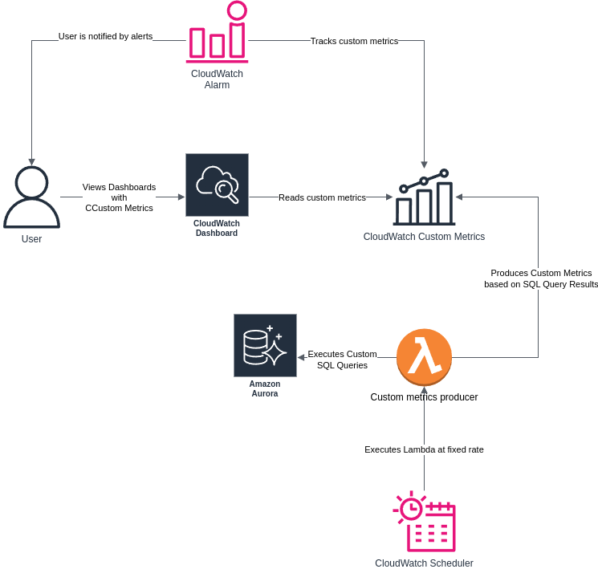

# aws-samples-lambda-python-cloudwatch-rds

# AWS Sample - Custom Metrics using Lambda in Python 

## Overview

This repository contains sample code that implements AWS CloudWatch Custom Metrics using Lambda in Python.

## Big picture

Lambda code queries database periodically using SQL Queries and generates custom metrics based on it. Lambda is executed based on CloudWatch Event Scheduler, which produces an event used to execute lambda at a fixed rate. Metrics are produced to a custom namespace, which are then used by CloudWatch Dashboards and CloudWatch Alerts.

## Author

Dominik Cebula

* https://dominikcebula.com/
* https://blog.dominikcebula.com/
* https://www.udemy.com/user/dominik-cebula/
